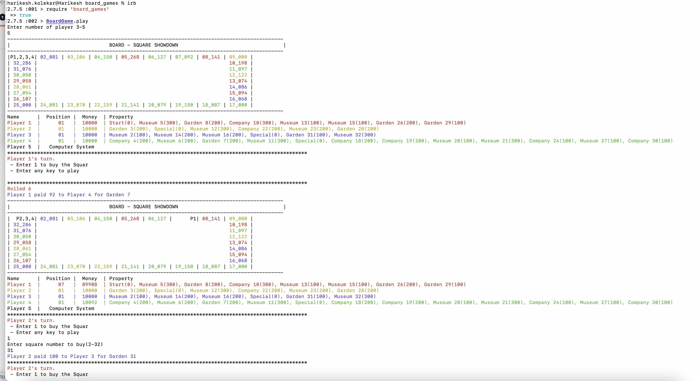

# BoardGames

You need to design a board game

It can be played by 3 to 5 players. One of that should be assigned a task to manage money.
The board has 9 squares each along its sides and 4 special squares at corner (one of them is Start). 
The player has a choice to buy that square as per its value. When any other player comes to a square which belongs to some-other player, he has to play rent to that player.
Each square represents either a Company, Garden, Museum, or Entertainment Park, Cinema Hall, Mall.
Players use dice turn by turn to move along the squares.
## Installation

Add this line to your application's Gemfile:

```ruby
gem 'board_games', github: 'harikesh-kolekar/board_game'
```

And then execute:

    $ bundle install

Or install it yourself as:

    $ gem install specific_install      
    $ gem specific_install https://github.com/harikesh-kolekar/board_game
    $ irb


## Usage

```ruby
require 'board_games'
BoardGame.play
```


## Development

After checking out the repo, run `bin/setup` to install dependencies. Then, run `rake spec` to run the tests. You can also run `bin/console` for an interactive prompt that will allow you to experiment.

To install this gem onto your local machine, run `bundle exec rake install`. To release a new version, update the version number in `version.rb`, and then run `bundle exec rake release`, which will create a git tag for the version, push git commits and tags, and push the `.gem` file to [rubygems.org](https://rubygems.org).

## Contributing

Bug reports and pull requests are welcome on GitHub at https://github.com/harikesh-kolekar/board_games. This project is intended to be a safe, welcoming space for collaboration, and contributors are expected to adhere to the [code of conduct](https://github.com/harikesh-kolekar/board_games/blob/master/CODE_OF_CONDUCT.md).


## License

The gem is available as open source under the terms of the [MIT License](https://opensource.org/licenses/MIT).

## Code of Conduct

Everyone interacting in the BoardGames project's codebases, issue trackers, chat rooms and mailing lists is expected to follow the [code of conduct](https://github.com/[USERNAME]/board_games/blob/master/CODE_OF_CONDUCT.md).
